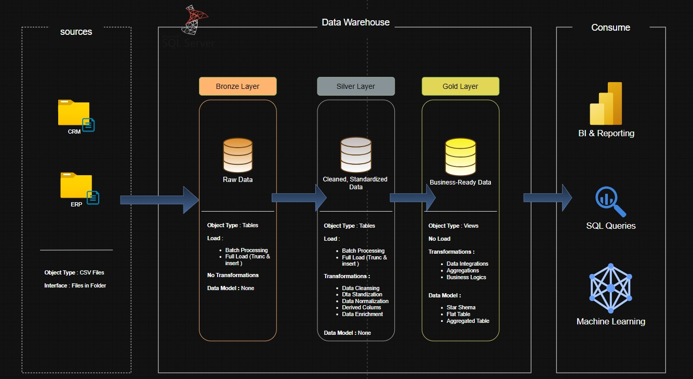

# SQL Data Warehouse Project

Welcome to this **Data Warehouse Implementation** repository.  
This project focuses on the design and construction of a modern data warehouse using a layered architecture. The scope covers **data ingestion, transformation, and modeling** across **Bronze, Silver, and Gold** layers.

---

## Data Architecture



The data warehouse follows the **Medallion Architecture**, structured into three logical layers to ensure data quality, maintainability, and analytical readiness.

### Architecture Layers

#### Bronze Layer
Stores raw data ingested directly from source systems. Data is loaded as-is from CSV files into SQL Server tables with minimal processing.

#### Silver Layer
Contains cleansed and standardized data. This layer handles data quality checks, normalization, deduplication, and basic transformations.

#### Gold Layer
Holds curated, business-ready data structured using dimensional modeling (star schema).  
Data in this layer is prepared for downstream analytics, even though reporting is outside the scope of this project.

Architecture and modeling diagrams are available in the `docs/` directory.

---

## Project Scope

This project includes:

### Modern Data Warehouse Design
Implementation of a Medallion Architecture with Bronze, Silver, and Gold layers.

### ETL / ELT Processes
Extraction of data from multiple source systems, transformation for data quality, and loading into structured warehouse tables.

### Data Modeling
Design of fact and dimension tables optimized for analytical use cases.

---

## Skills Demonstrated

This project showcases practical experience in:

- SQL Development  
- Data Warehousing Concepts  
- Medallion Architecture  
- ETL / ELT Pipelines  
- Data Cleansing and Standardization  
- Dimensional Data Modeling  

---

## Tools & Technologies

All tools used in this project are free and commonly used in industry:

- **SQL Server Express** – Data warehouse platform  
- **SQL Server Management Studio (SSMS)** – Database development and management  
- **CSV Files** – Source data from ERP and CRM systems  
- **Draw.io** – Architecture, data flow, and data model diagrams  
- **Git & GitHub** – Version control and project management  

---

## Project Requirements

### Data Engineering – Data Warehouse Construction

**Objective**  
Build a structured data warehouse to consolidate data from multiple source systems and prepare it for analytical consumption.

**Specifications**

- Import data from ERP and CRM systems provided as CSV files  
- Preserve raw data in the Bronze layer  
- Apply cleansing and transformation logic in the Silver layer  
- Create dimensional models in the Gold layer  
- Focus on the latest data only (no historization)  
- Document data models and architecture clearly  

---

## Repository Structure

```text
data-warehouse-project/
│
├── datasets/                      # Raw source datasets (CSV files)
│
├── docs/                          # Architecture and documentation
│   ├── data_architecture.png      # Medallion architecture diagram
│   ├── dataflow.jpeg              # Data flow diagram
│   └── data_model.jpeg            # Star schema models
│
├── scripts/                       # SQL scripts
│   ├── bronze/                    # Raw data ingestion
│   ├── silver/                    # Data cleansing and transformation
│   └── gold/                      # Dimensional modeling
│
├── tests/                         # Data quality checks
│   ├── quality_checks_gold.sql    # Gold layer data quality checks
│   └── quality_checks_silver.sql  # Silver layer data quality checks
│
└── README.md                      # Project documentation
